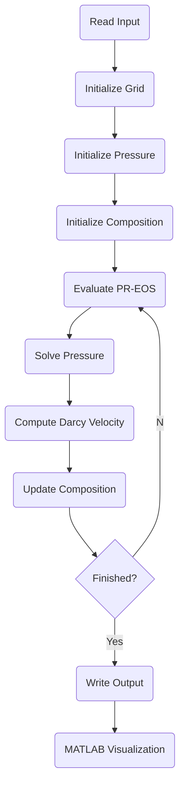
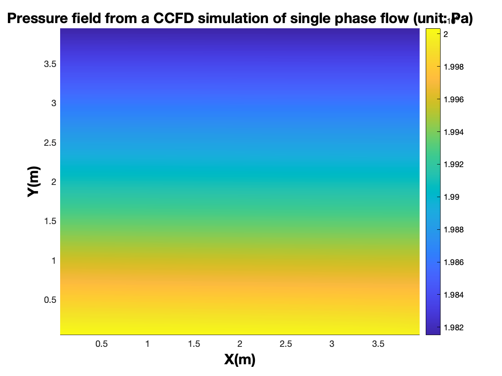
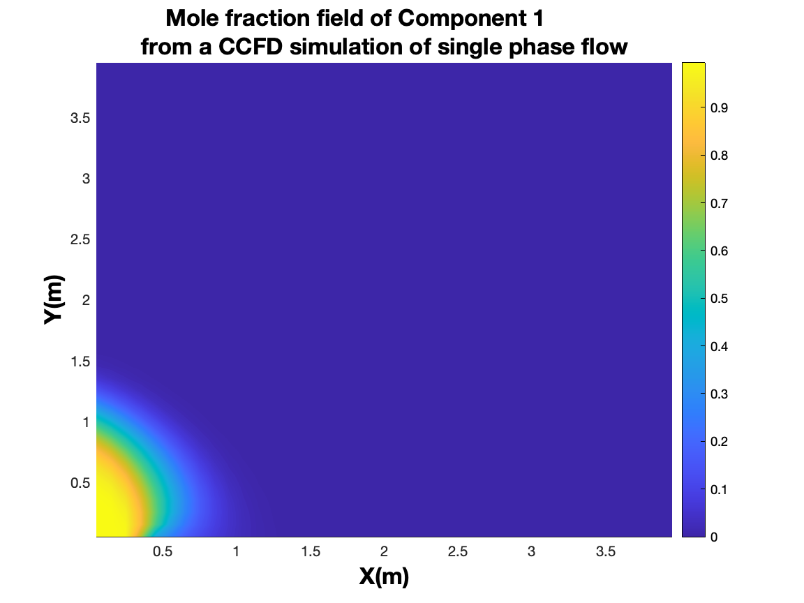
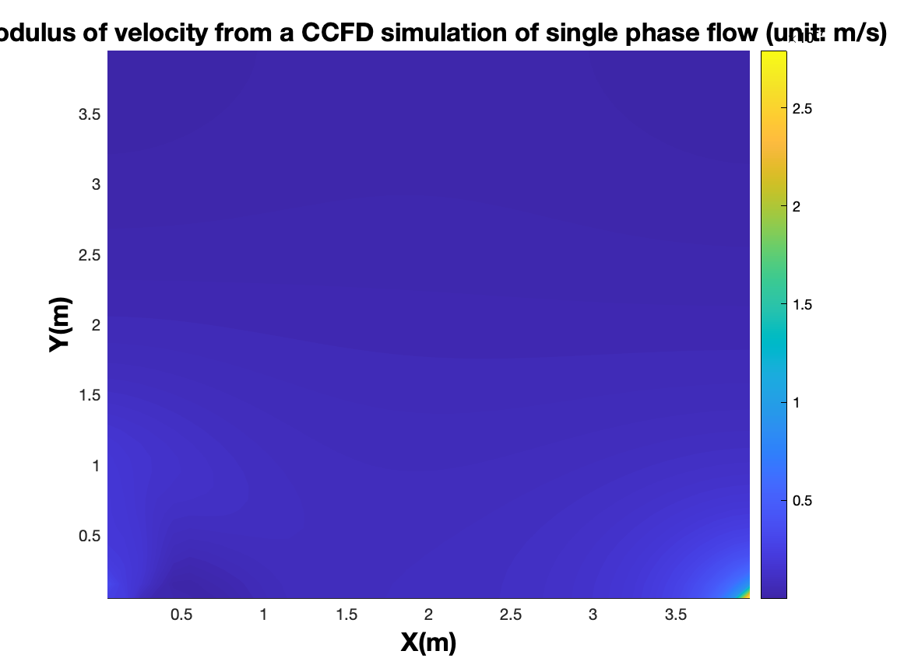
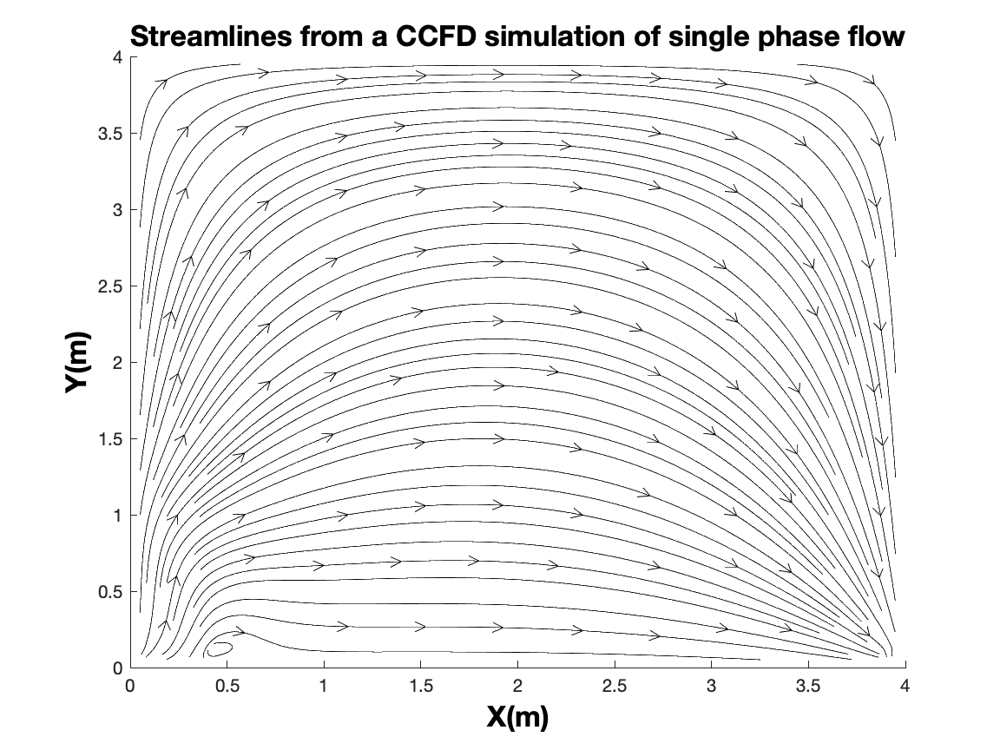

# MulticomponentFlow

> **A high-performance multi-component porous-media flow simulator based on the Peng–Robinson Equation of State (PR-EOS).**  
> Developed for research in computational geoscience, reservoir simulation, and scientific computing.


---

## Table of Contents

1. Introduction
2. Key Features
3. Mathematical Model
4. Numerical Method
5. Software Architecture
6. Repository Layout
7. Build & Run
8. Input / Output
9. Example Results
10. Parallel Computing
11. Code Design
12. Development Roadmap
13. Citation
14. License

---

# 1. Introduction

**MulticomponentFlow** is a modular research code for simulating multicomponent single-phase flow in porous media.

The simulator couples

- Darcy flow
- multicomponent transport
- Peng–Robinson EOS
- composition-dependent fluid properties

within a finite-difference framework.

The project contains

- **Serial Fortran solver**
- **MPI parallel implementation**
- **MATLAB preprocessing & visualization, implementation**
- Example benchmark cases

---

# 2. Key Features

- ✔ Finite-difference formulation
- ✔ Structured Cartesian grids
- ✔ Peng–Robinson Equation of State
- ✔ Composition-dependent density & viscosity
- ✔ Modular Fortran architecture
- ✔ MPI parallel implementation
- ✔ MATLAB visualization tools
- ✔ Research-oriented code structure

---

# 3. Mathematical Model

The simulator solves

### Mass conservation

∂(ϕρ)/∂t + ∇·(ρu) = q

with Darcy's law

**u = -(k/μ)(∇p − ρg∇z)**

where thermodynamic properties are evaluated through the Peng–Robinson EOS.

---

# 4. Numerical Workflow



---

# 5. Software Architecture

```text
                +---------------------+
                |   Driver Program    |
                +----------+----------+
                           |
        +------------------+-------------------+
        |                  |                   |
  Grid / Model        Thermodynamics      Flow Solver
        |                  |                   |
   Input Parser        PR-EOS Module      Pressure Solver
        |                  |                   |
        +------------------+-------------------+
                           |
                     Output Writer
                           |
                    MATLAB Postprocess
```

Each module has a single responsibility, making it straightforward to replace constitutive models or numerical solvers.

---

# 6. Repository Layout

```text
Fortran/
    Serial implementation

Hpc/
    MPI implementation
    Makefiles
    Cluster scripts

Matlab/
    2D visualization, 2D implementation
    3D visualization, 3D implementation
    Initial-condition generation
```

---

# 7. Build & Run

## Serial

```bash
cd Fortran
gfortran *.F90 -O3 -o MulticomponentFlow
./MulticomponentFlow
```

## MPI

```bash
cd Hpc
make
mpirun -np 8 ./MulticomponentFlow_hpc
```

---

# 8. Input / Output

## Typical Input

| Parameter | Description |
|-----------|-------------|
| Grid size | Computational mesh |
| Porosity | Rock property |
| Permeability | Rock property |
| Temperature | Reservoir temperature |
| Initial pressure | Pressure field |
| Mole fractions | Fluid composition |
| Time step | Simulation control |

## Typical Output

- Pressure
- Velocity
- Density
- Mole fractions
- MATLAB visualization files

---

# 9. Example Results

### Pressure Field

<p align="center">
  
</p>

---

### Composition Distribution

<p align="center">
  
</p>

---

### Velocity Field

<p align="center">
  
</p>

---

### Streamlines

<p align="center">
  
</p>

# 10. Parallel Computing

The MPI implementation targets distributed-memory HPC systems.

Suggested benchmark figures:

| Metric | Description |
|--------|-------------|
| Strong scaling | Fixed problem size |
| Weak scaling | Fixed workload/core |
| Parallel efficiency | Scaling efficiency |
| Runtime | Wall-clock time |

---

# 11. Code Design Philosophy

The code follows a modular scientific-computing design:

- Physics separated from numerics
- Thermodynamics isolated from flow solver
- Independent I/O layer
- MATLAB for post-processing
- Easy extension to additional EOS or multiphase models

---

# 12. Development Roadmap

## Planned Features

- [ ] Two-phase compositional flow
- [ ] Capillary pressure
- [ ] Relative permeability
- [ ] Adaptive mesh refinement
- [ ] GPU acceleration
- [ ] Automatic differentiation
- [ ] Unit tests
- [ ] Continuous Integration
- [ ] Doxygen/FORD documentation

---

# 13. Citation

```bibtex
@software{wu_multicomponentflow,
  author={Yuanqing Wu},
  title={MulticomponentFlow},
  year={2026}
}
```

---

# 14. License

Please select an open-source license before public release.

Recommended:

- MIT
- BSD-3-Clause

---

# Contributing

Contributions are welcome through Issues and Pull Requests.

Please include:

- clear description
- reproducible example
- documentation update when appropriate

---

# Contact

**Yuanqing Wu**

King Abdullah University of Science and Technology (KAUST)

---

## Suggested Companion Files

For a polished open-source repository, consider adding:

- `LICENSE`
- `CONTRIBUTING.md`
- `CHANGELOG.md`
- `.gitignore`
- `docs/`
- `examples/`
- `CITATION.cff`
- GitHub Actions workflow (`.github/workflows/ci.yml`)
